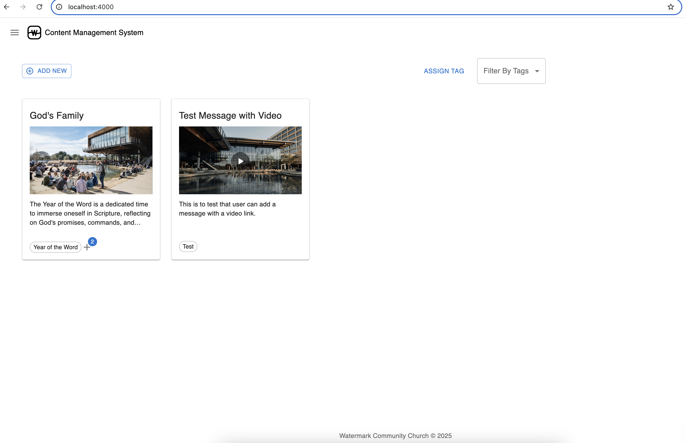

# Messages - Content Management System

## Environment

* Node 20.18.0
* Python 3.11.9
* Docker 27.5.1

## Local Server

1. Install front end dependencies

    ```
    cd frontend
    npm install
    ```

2. Install backend dependencies

    ```
    cd backend
    python -m venv venv
    source venv/bin/activate
    pip install -r requirements.txt
    ```

3. Update Local SQLite DB (if not created)

    ```
    cd backend
    flask db init
    flask db migrate
    flask db upgrade
    sqlite3 app.db ".tables"
    ```

4. Enable Video Transcription

    Download the Automatic Speech Recognition Model (~ 4 minutes)
    ```
    cd backend
    curl -L https://alphacephei.com/vosk/models/vosk-model-en-us-0.22.zip -o app/toolkit/vosk-model.zip
    unzip app/toolkit/vosk-model.zip -d app/toolkit/
    ```

    For sample short video to upload, please use the `VITE_DEFAULT_VIDEO` URL provided in `.env`

5. Test Locally

* Frontend
    * Start the React app in a terminal
        ```
        cd frontend
        npm run dev
        ```
    * Test on another terminal
        ```
        cd frontend
        npm test
        ```

* Backend
    * Start the Flask app in a terminal
        ```
        cd backend
        python wsgi.py
        ```
    * Test on another terminal
        ```
        cd backend
        pytest -s tests/
        ```

* Stop all containers after testing to release the ports

6. Start the application containers

    (~ 4 minutes)
    ```
    docker compose down
    docker compose up --build
    ```

    Access the application

    * Web UI: http://localhost:4000

        

    * API Server: http://localhost:8000

        

    * [Walkthrough](assets/walthrough.mov)

---

## Video Transcription Models

[Reference](backend/app/toolkit/readme.md)
